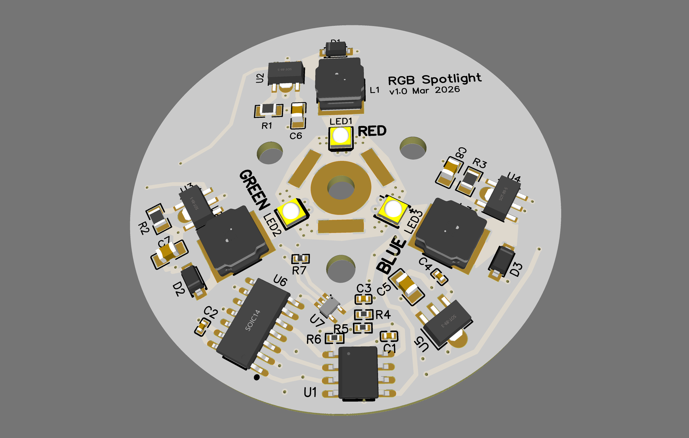
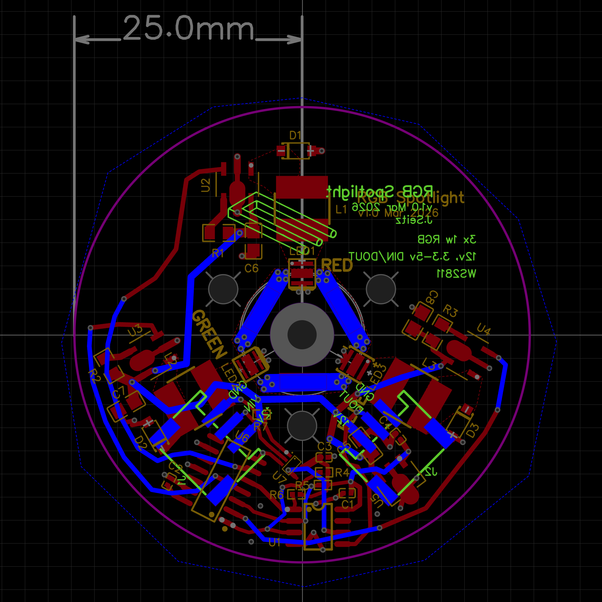

# RGB Spotlight

25mm circular chainable RGB spotlight pixel for LED installations.



## Overview

- **Input:** 12V / DIN / GND (3-wire JST PH chain)
- **Controller:** WS2811 (NeoPixel-compatible, 800kHz)
- **LED drivers:** 3x PT4115 constant-current buck converters at 454mA/channel
- **LEDs:** XINGLIGHT HD2525 series — Red (625nm), Green (525nm), Blue (455nm)
- **Power:** ~4.73W per pixel at full white
- **Level shifter:** SN74AHCT1G125 on DIN for 3.3V controller compatibility
- **Inverter:** 74HC04 corrects WS2811 open-drain / PT4115 active-high DIM polarity

## PCB

- 50mm diameter, 2-layer, 1.6mm FR4
- Top: 3x LEDs in triangle, JST PH connectors at edges
- Bottom: PT4115 groups at 120 degree spacing, WS2811 + 74HC04 center



## BOM

16 line items, ~$2.24/unit at qty 1 pricing. 10 extended parts = $30 one-time setup fee.

Project BOM config now lives at `.bomi/project.yaml` (migrated from legacy `.jlcpcb/project.yaml`).

Use `bomi` to inspect/refresh the BOM and export files:

```bash
bomi status                                # overview + warnings
bomi fetch --all --force                   # refresh all selected parts from API
bomi list --check                          # validate BOM against latest catalog data
bomi list --format markdown > docs/BOM_rgb-spotlight.md
bomi list --format csv > docs/BOM_rgb-spotlight.csv
```

See [docs/BOM_rgb-spotlight.md](docs/BOM_rgb-spotlight.md) for the latest part snapshot and [rgb-spotlight-bom.md](rgb-spotlight-bom.md) for design rationale/connection tables.

## Design Decisions

See [rgb-spotlight-bom.md](rgb-spotlight-bom.md) for detailed rationale on every component choice, including the WS2811 inversion problem and why the 74HC04 is worth $0.17/unit.
